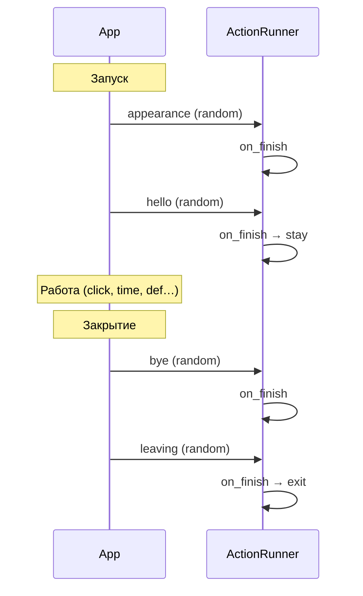
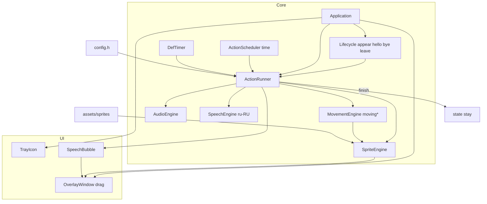

# Six_Seven — виртуальный помощник Windows (Planner)

## Background and Motivation

**Цель:** создать настольного виртуального помощника **Six_Seven** на C++, визуально и по поведению напоминающего культового **BonziBuddy** (фиолетовый персонаж, озвучка, шутки, анимации, иконка в трее), но **без слежки, рекламы и вредоносного поведения**.

**Целевые ОС:** Windows XP, 7, 10, 11 (один проект, разные сборки/профили совместимости).

**Проект:** `67_helper` — этап 0 выполнен; `config.h` будет расширен под полную модель типов (см. ниже).

### Что было у BonziBuddy (исторический контекст)

| Аспект | BonziBuddy | Six_Seven (наш подход) |
|--------|------------|------------------------|
| Движок персонажа | **Microsoft Agent 2.0** (.ACS, 137+ анимаций, COM) | **Собственный** sprite/state machine (Agent с Win7 deprecated, на 10/11 недоступен) |
| Озвучка | **SAPI 4.0** (голос «Sydney», L&H) | **SAPI 5** (`ISpVoice`) на XP–11; опционально WAV из `config.h` |
| UI | Overlay поверх рабочего стола, трей | То же: layered Win32 window + `NOTIFYICONDATA` |
| Функции | Шутки, факты, песни, «помощь» с загрузками | Локальные скрипты/фразы; загрузки — только если пользователь явно включил |
| Интеграция с IE | Toolbar, смена homepage, BHO | **Запрещено по умолчанию** (`FEATURE_NETWORK = 0`) |
| Приватность | Spyware/adware, сбор данных, COPPA-штрафы | **Privacy-by-design**: нет фоновой сети, нет телеметрии, открытый manifest в коде |

**Референсы:** [BonziBuddy (Wikipedia)](https://en.wikipedia.org/wiki/BonziBUDDY), [MS Agent Character Format](https://uploads.s.zeid.me/ms-agent-format-spec.html), layered windows ([MSDN Magazine](https://learn.microsoft.com/en-us/archive/msdn-magazine/2005/december/c-at-work-layered-windows-blending-images)).

---

## Key Challenges and Analysis

### 1. Microsoft Agent нельзя взять «как есть»

- Agent официально **deprecated с Windows 7**, на 10/11 не рассчитывать.
- Bonzi использовал `Show()`, `Hide()`, `Play()`, `Speak()` через Agent + VB6.
- **Решение:** свой формат анимаций (PNG-кадры / sprite sheet + JSON или таблица в `config.h`) и конечный автомат состояний (Idle, Walk, Wave, Speak, …).

### 2. Один код на XP и Windows 11

| Технология | XP | 7 | 10/11 |
|------------|----|---|-------|
| `WS_EX_LAYERED` + `UpdateLayeredWindow` | ✅ | ✅ | ✅ |
| Direct2D / DirectComposition | ❌ | частично | ✅ |
| DWM blur | ❌ | ✅ | ✅ |
| SAPI 5 (`sapi.lib`) | ✅ (встроен в XP) | ✅ | ✅ |
| C++ стандарт | C++03 / TR1 | C++11 | C++17 (отдельная ветка сборки) |

**Решение:** ядро на **Win32 + GDI** (bitmap с альфой/colorkey `#FF00FF`). Профиль `SIX_SEVEN_MODERN` — опциональный рендер через D2D (только если `IsWindowsVistaOrGreater()`).

### 3. «Как Bonzi, но без слежки» — явный Privacy Charter

Закодировать в `config.h` и `privacy_manifest.h`:

- `SIX_SEVEN_ALLOW_NETWORK` — **0** по умолчанию.
- `SIX_SEVEN_ALLOW_REGISTRY_WRITE` — только `HKCU\Software\Six_Seven\` (настройки).
- `SIX_SEVEN_ALLOW_BROWSER_HOOKS` — **0**, навсегда.
- `SIX_SEVEN_ALLOW_FILE_SYSTEM_SCAN` — **0** (не читать документы/почту).
- Логи — только локальный файл при `SIX_SEVEN_DEBUG_LOG=1`.
- Любая «онлайн-фича» (погода, поиск) — отдельный модуль, включается галочкой в настройках + предупреждение.

### 4. Поведение «как у друга на столе»

Воспроизвести **ощущение**, не копировать вредонос:

- **Перетаскивание:** ЛКМ по персонажу — drag окна по всему экрану; позиция сохраняется между сессиями.
- **Базовое состояние `stay`:** персонаж **стоит** — статичный спрайт `stay`, без проигрывания кадров.
- **Скука `def`:** при долгом игноре — моргание, рыгание, икота, фразы и/или **переезд** на другое место (спрайты `moving*` по компасу).
- **Типы действий** в `config.h`: `click`, `time`, `appearance`, `hello`, `bye`, `leaving`, `def` (+ спрайты движения, `stay` как состояние).
- **Тип `click`:** ПКМ по персонажу → контекстное меню пунктов; каждый пункт = связка **спрайт + звук(и) + фраза(ы)**. Пример «Читать книгу»: спрайт `read_book`, бубнёж WAV, TTS; по **окончании one-shot анимации** (или по таймауту из config) — возврат в `idle`, озвучка останавливается.
- **Речь:** при любой озвучиваемой фразе — **облачко комикса** над персонажем (белый фон, чёрная рамка, текст по-русски). TTS только **русский** (SAPI voice с `LANG_RU` / hint в config).
- Звуки `.wav` + спрайт `speak` / `speak_idle` во время речи.

### 5. Единая папка `sprites`

Спрайт и анимация — **одна сущность**: последовательность PNG в подпапке `assets/sprites/<имя>/` (кадры `0001.png` … или один `.png` sheet). Отдельной папки `animations/` **нет**.

### 6. Облачко речи (Speech Bubble) — как BonziBuddy

- **Обязательно** при озвучиваемой фразе (этап 3, модуль `SpeechBubble`).
- Стиль Bonzi: белый фон, чёрная рамка, скругление, **хвост** к голове персонажа.
- Параметры: `config.h` + `docs/SPEECH_BUBBLE.md`.
- Текст RU в облачке синхронно с SAPI TTS.

---

## High-level Task Breakdown

Каждый шаг — для **Executor**; переход к следующему только после проверки человеком.

### Этап 0 — Каркас репозитория
- [x] Структура каталогов (см. ниже).
- [x] `config.h` (шаблон со всеми секциями).
- [x] `README.md` с Privacy Charter и требованиями к сборке.
- [x] `include/ActionTypes.h`, `src/ConfigTables.cpp`, `CMakeLists.txt`, `build.bat`.
- [ ] **Проверка сборки на машине пользователя** (CMake/MSVC не найдены в CI-окружении агента).
- **Критерий успеха:** `build.bat` → `Six_Seven_ConfigCheck.exe` выводит сводку config.

### Этап 1 — Win32 overlay + перетаскивание
- [ ] `Application.cpp`: `WinMain`, message loop, COM init.
- [ ] Layered top-level window, colorkey или per-pixel alpha через `UpdateLayeredWindow`.
- [ ] **Drag:** `WM_LBUTTONDOWN` → захват, `WM_MOUSEMOVE` с `SetWindowPos`, границы — рабочая область монитора (`MonitorFromWindow`).
- [ ] `WM_NCHITTEST`: прозрачный фон — `HTTRANSPARENT` только вне силуэта персонажа (по маске или bbox).
- **Критерий успеха:** персонаж перетаскивается по экрану; позиция сохраняется (этап 5).

### Этап 2 — Спрайты, stay/def, компас moving*
- [ ] `SpriteEngine` + `MovementEngine` (8 направлений + диагонали).
- [ ] `ActionRunner`: все типы из `config.h`; после действия → **`stay`**.
- [ ] Placeholder-спрайты: `stay`, `moving*`, `appearance*`, `hello`, `bye`, `leaving*`, `def/*`.
- **Критерий успеха:** ПКМ `click` работает; после действия — `stay`; при перемещении — верный спрайт `movingRU` и т.д.

### Этап 2b — Жизненный цикл (appearance → hello / bye → leaving)
- [ ] Старт: **appearance** (случайная запись) → **hello** (случайная).
- [ ] Закрытие: блокировать выход до конца цепочки **bye** → **leaving** (случайные записи).
- **Критерий успеха:** при запуске и закрытии проигрываются обе фазы в правильном порядке.

### Этап 3 — TTS (RU), WAV и облачко
- [ ] `SpeechEngine`: SAPI5, язык **русский**, `Speak()` async + callback окончания.
- [ ] `SpeechBubble`: отрисовка текста в комикс-рамке над спрайтом.
- [ ] `AudioEngine`: WAV параллельно TTS (бубнёж при «читать книгу»).
- **Критерий успеха:** фраза на русском в облачке и голосом; WAV слышен; облачко исчезает после речи.

### Этап 4 — def, stay, time
- [ ] Таймер `def` (`SIX_SEVEN_DEF_MIN_MS` … `MAX_MS`); сброс при drag/клике/речи.
- [ ] Случайная запись из `SIX_SEVEN_DEF_ACTIONS` (моргать, рыгать, икать, фраза, переезд с `moving*`).
- [ ] **`stay`:** между действиями — статичный спрайт, без анимации.
- [ ] **`time`:** `ActionScheduler` — по `delay_ms` из config проигрывает привязанные спрайт/звук/фразу (циклично или один раз).
- **Критерий успеха:** долгий игнор → `def`; между сценами — `stay`; таймер `time` срабатывает в заданный интервал.

### Этап 5 — System tray и настройки
- [ ] Иконка в трее, меню: показать/скрыть, mute, exit.
- [ ] Сохранение позиции окна и флагов в `HKCU\Software\Six_Seven` или `six_seven.ini`.
- **Критерий успеха:** после перезапуска позиция и «не беспокоить» сохраняются.

### Этап 6 — Кросс-сборка XP / Modern
- [ ] `CMakeLists.txt` или два `.vcxproj`: `Six_Seven_XP` (toolset v141_xp / MinGW-w64 i686) и `Six_Seven` (x64/x86).
- [ ] `OsCompat.cpp`: `GetVersionEx` / `IsWindows10OrGreater` для ветвления.
- [ ] Документация по тестам на XP SP3, 7 SP1, 10, 11.
- **Критерий успеха:** два installer-ready `.exe` или один exe с проверкой ОС.

### Этап 7 — Полировка (опционально)
- [ ] Документ `docs/SPRITE_FORMAT.md` (кадры, fps, loop).
- [ ] Подпись кода / installer (Inno Setup).

---

## Модель действий (типы в `config.h`)

Полная спецификация: **`docs/ACTION_TYPES.md`**.

### Сводка типов

| Тип | Когда | Случайный выбор |
|-----|--------|-----------------|
| **stay** | Состояние по умолчанию между действиями | — (один статичный спрайт) |
| **click** | ПКМ → пункт меню | — (меню из всех записей) |
| **time** | Планировщик, интервал `delay_ms` в config | — |
| **appearance** | Запуск приложения (1-я фаза) | ✅ если несколько записей |
| **hello** | Сразу после appearance | ✅ |
| **bye** | Закрытие (1-я фаза) | ✅ |
| **leaving** | После bye, перед уничтожением окна | ✅ |
| **def** | Долгий игнор пользователя | ✅ |

**Не путать:** `def` = активность при скуке (анимации, звуки, переезд). `stay` = тихая стойка без анимации.

### Цепочки жизненного цикла



### Компас перемещения (спрайты `moving*`)

При автоматическом переезде (`def` с `move=1`) или скриптовом движении `MovementEngine` выбирает спрайт по вектору (как компас):

```
        movingU
          ↑
 movingLU ↖ ↗ movingRU
          ╳
 movingL ← ● → movingR
          ╳
 movingLD ↙ ↘ movingRD
          ↓
        movingD
```

Имена папок: `movingD`, `movingL`, `movingU`, `movingR`, `movingRU`, `movingLU`, `movingLD`, `movingRD` — все в `SIX_SEVEN_MOVE_SPRITE_TABLE`.

### Общие поля действия (`SixSevenActionDef`)

| Поле | Описание |
|------|----------|
| `type` | см. таблицу типов |
| `id` | уникальный идентификатор |
| `menu_label` | только `click` — пункт ПКМ (RU) |
| `delay_ms` | только `time` — интервал |
| `sprite` | подпапка `assets/sprites/<name>/` |
| `sprite_mode` | `loop` \| `oneshot` |
| `on_finish` | `ReturnStay` \| `ChainNext` (для appearance→hello в коде) |
| `sound`, `phrase`, `phrase_file` | WAV + TTS + облачко (RU) |
| `stop_tts_on_finish` | оборвать TTS по концу one-shot |
| `move` | только `def`: переезд; спрайт из компаса |

### Тип `click` (ПКМ)

Без изменений: меню из `SIX_SEVEN_CLICK_ACTIONS` → `Run` → по окончании **`stay`**.

### Тип `time`

```cpp
#define SIX_SEVEN_TIME_ACTIONS \
    ACTION_TIME(remind_hour, 3600000, "speak", oneshot, "", L"Прошёл час!") \
    ACTION_TIME(yawn,         120000,  "yawn",  loop,   SIX_SEVEN_ASSETS_DIR "/sounds/yawn.wav", L"")
```

- `ActionScheduler`: для каждой записи свой таймер `delay_ms` (можно сбрасывать при активности пользователя — флаг в config).

### Типы `appearance` / `hello` / `bye` / `leaving`

```cpp
#define SIX_SEVEN_APPEARANCE_ACTIONS \
    ACTION_APPEARANCE(pop_up,   "appearance_pop",  oneshot, "", L"") \
    ACTION_APPEARANCE(fade_in,  "appearance_fade", oneshot, "", L"")

#define SIX_SEVEN_HELLO_ACTIONS \
    ACTION_HELLO(hi1, "wave", oneshot, "", L"Привет! Я Six_Seven!") \
    ACTION_HELLO(hi2, "speak", oneshot, SIX_SEVEN_PHRASES_HELLO, L"")

#define SIX_SEVEN_BYE_ACTIONS \
    ACTION_BYE(bye1, "wave", oneshot, "", L"Пока-пока!") \
    ACTION_BYE(bye2, "speak", oneshot, "", L"До встречи!")

#define SIX_SEVEN_LEAVING_ACTIONS \
    ACTION_LEAVING(walk_off, "leaving_walk", oneshot, "", L"") \
    ACTION_LEAVING(sink,     "leaving_sink", oneshot, "", L"")
```

- **Старт:** `Lifecycle::OnStartup()` → random(appearance) → random(hello) → `stay`.
- **Закрытие:** `WM_CLOSE` / Exit из трея → random(bye) → random(leaving) → `DestroyWindow`.

### Тип `def` (бывший «idle» при скуке)

```cpp
#define SIX_SEVEN_DEF_MIN_MS  90000
#define SIX_SEVEN_DEF_MAX_MS  180000

#define SIX_SEVEN_DEF_ACTIONS \
    ACTION_DEF(blink,  "def_blink", oneshot, 0, "", L"") \
    ACTION_DEF(burp,   "def_burp",  oneshot, 0, SIX_SEVEN_ASSETS_DIR "/sounds/burp.wav", L"") \
    ACTION_DEF(hiccup, "def_hiccup",oneshot, 0, SIX_SEVEN_ASSETS_DIR "/sounds/hiccup.wav", L"") \
    ACTION_DEF(wander, "movingU",   loop,    1, "", L"Пойду прогуляюсь")  /* move=1 → MovementEngine */
```

### Состояние `stay`

```cpp
#define SIX_SEVEN_DEFAULT_STATE_SPRITE  "stay"   /* 1 кадр или статичный PNG */
#define SIX_SEVEN_STAY_ANIMATE          0        /* 0 = не крутить кадры */
```

---

---

## Предлагаемая структура проекта

```
67_helper/
├── config.h                 # главный файл настроек (звуки, анимации, фичи)
├── privacy_manifest.h       # неизменяемые privacy-константы
├── CMakeLists.txt
├── src/
│   ├── main.cpp
│   ├── Application.{h,cpp}
│   ├── OverlayWindow.{h,cpp}
│   ├── SpriteEngine.{h,cpp}     # спрайт = анимация (кадры в sprites/)
│   ├── ActionRunner.{h,cpp}     # все типы действий
│   ├── ActionScheduler.{h,cpp}  # time
│   ├── MovementEngine.{h,cpp}   # moving* компас
│   ├── Lifecycle.{h,cpp}        # appearance→hello, bye→leaving
│   ├── SpeechBubble.{h,cpp}
│   ├── AudioEngine.{h,cpp}
│   ├── SpeechEngine.{h,cpp}     # TTS ru-RU
│   ├── TrayIcon.{h,cpp}
│   ├── Phrases.{h,cpp}
│   ├── Config.cpp
│   └── OsCompat.{h,cpp}
├── assets/
│   ├── sprites/                 # stay/, moving*, def_*, appearance*, leaving*, ...
│   ├── sounds/
│   └── phrases/                 # idle_ru.txt, jokes_ru.txt, ...
└── docs/
    └── SPRITE_FORMAT.md
```

---

## Спецификация `config.h` (черновик v0.2 — Executor обновит код этапа 0)

См. полный пример в `docs/ACTION_TYPES.md`. Ключевые блоки:

- `SIX_SEVEN_SPRITE_TABLE` — все спрайты включая `stay`, `moving*`, `def_*`, lifecycle.
- `SIX_SEVEN_MOVE_SPRITE_TABLE` — 8 направлений (fps/loop).
- `SIX_SEVEN_CLICK_ACTIONS`, `SIX_SEVEN_TIME_ACTIONS`, `SIX_SEVEN_DEF_ACTIONS`.
- `SIX_SEVEN_APPEARANCE_ACTIONS`, `SIX_SEVEN_HELLO_ACTIONS`, `SIX_SEVEN_BYE_ACTIONS`, `SIX_SEVEN_LEAVING_ACTIONS`.
- `SIX_SEVEN_DEFAULT_STATE_SPRITE` / `SIX_SEVEN_STAY_ANIMATE`.
- `SIX_SEVEN_DEF_MIN_MS` / `MAX_MS`, `SIX_SEVEN_MOVE_SPEED_PX`.

Макросы: `SPRITE`, `ACTION_CLICK`, `ACTION_TIME`, `ACTION_DEF`, `ACTION_APPEARANCE`, `ACTION_HELLO`, `ACTION_BYE`, `ACTION_LEAVING`.  
`ReturnStay` вместо `ReturnIdle`. ПКМ-меню — только записи `click`.

---

## Архитектура (логическая схема)



---

## Project Status Board

- [x] **P0** Утверждён план
- [x] **E0** Каркас + `config.h` (сборка — у пользователя)
- [x] **E1–E5** Реализовано в одной сборке (overlay, drag, спрайты, действия, TTS, облачко, def, time, lifecycle, трей, ini)
- [x] **E6** Кнопка «Прикольные игры» → Limbo Keys + GitHub repo
- [ ] **E7** Проверка на XP / доработки после фидбека пользователя

---

## Current Status / Progress Tracking

**Режим:** Executor  
**Дата:** 2026-08-26  
**Состояние:** Добавлена кнопка «Прикольные игры» → Limbo Keys; репозиторий на GitHub.

**2026-08-26 — Прикольные игры / Limbo Keys:**
- **Папка:** `assets/games/limbo keys/` — скопированы `limbo key.exe` + `resources/`.
- **Меню:** ПКМ → Спец. функции → Прикольные игры → Limbo Keys.
- **Запуск:** `ShellExecuteW` по пути `assets\games\limbo keys\limbo key.exe`.
- **Код:** `Application.cpp` — `kMenuCoolGamesLimboKeys = 2301`, подменю в `special`, обработчик `ShellExecuteW`.
- **Сборка:** `build-mingw.bat` — ✅ успешно.
- **GitHub:** https://github.com/fddqdddd/-six-seven_helper (публичный).

**2026-06-15 — админ-панель / терминал / знакомство:**
- **Админ панель:** ПКМ → Спец. функции → Админ панель (пароль → кнопки: логотип загрузки, откат профиля, снять ограничения терминала, Commands).
- **Терминал:** `TerminalGuard` закрывает cmd/PowerShell/WT, пока не сняты ограничения; 67 говорит «ОЙ, это тебе не понадобится…». Исключение: `Application::AllowAppTerminal()` для вызовов от 67.
- **Команды:** после первого входа в терминал со снятыми ограничениями — фраза 67, кнопка Commands, команды: `six-seven_open`, `kill_67`, `sleep67`, `67move`.
- **Знакомство:** 67 по центру после появления; диалоги по центру; один раз сдвиг 67 вверх при первом окне вопросов.
- Флаги в `information`: `terminal_unlocked`, `commands_unlocked`.

**2026-06-08 — пение / мелодии:**
- Модуль `SongMelody`: токенизация слов, SSML с `pitch="+Nst"`, паузы между словами/знаками препинания.
- У каждой песни в `Songs.cpp` — массив полутонов и пауз (`birthday`, `grupa_krovi`).
- `config.h`: `SING_RATE=2`, prosody `+12%`, короткие паузы (45–220 ms).
- Сборка успешна (`build-mingw`).

**2026-06-09 — профиль / перезагрузка:**
- После знакомства: UAC → `--setup` (backup + apply + boot task) → блокировка мыши → авто-перезагрузка.
- Откат: `RequestRevertAndWait`, удаление `six_seven_*.png`, CorrelationID из пути картинки, HKCU для всех размеров.
- Откат имени: fallback на `orig_login_name`, если `orig_display_name` пусто или «67».

**Состояние (ранее):** Boot splash — полноэкранная анимация `sprites/loading/` при старте Windows.

**2026-06-09 — boot splash / loading:**
- Папка `assets/sprites/loading/` — PNG-кадры анимации (0001.png …).
- Модуль `BootSplash`: полноэкранное layered-окно на весь виртуальный экран, loop-анимация.
- При автозапуске (`[boot] autostart=1` → HKCU Run) показывается после входа в Windows, пока Shell грузится; затем обычный Six_Seven.
- Настройки в `six_seven.ini` → `[boot]`: `enabled`, `autostart`, `min_sec`.
- Ограничение: заменить **нативный** экран загрузки Windows (до логона) user-mode приложением нельзя — только overlay при старте Six_Seven.

**2026-06-08 — first run / знакомство:**
- **Тип `First`:** при отсутствии `information` — сон `first/sleep` (loop), по клику — `first/appearance`.
- **Диалог:** имя (окно), цвет (список радуги + белый/чёрный/радужный), фразы с ассоциациями; зелёный — особая реакция 67.
- **Сохранение:** `information` рядом с exe (`name`, `color`, `onboarded`).
- **Персонализация фраз:** токены `friend` и `color` в `phrase_file` / inline-фразах.
- **Исправлено:** облачко при first-run (typewriter без ActionRunner); idle после 1-й фразы; короткие прогулки во время диалога.

**2026-06-08 — чтение / sleep:**
- **«Читать книгу»:** loop-анимация, бубнёж WAV, без TTS и облачка; до перетаскивания (ЛКМ).
- **Таймер скуки:** на паузе, пока персонаж читает/спит (`persistent`); после drag — `ScheduleDef()`.
- **Тип `Sleep`:** при срабатывании def с шансом `SIX_SEVEN_DEF_SLEEP_CHANCE` (25%) — чтение или `sleep/dozing`.
- **Пробуждение:** перетаскивание (ЛКМ); ПКМ-меню может сменить действие.

**Исправлено 2026-06-04 (2):**
- **«?» после обычной мини-игры:** `Stop()` всегда вызывал `glitchSprites_.Shutdown()` без предшествующего `Init()` → `GdiplusShutdown` для всего приложения. Добавлен флаг `inited_` в `SpriteEngine::Shutdown()`.
- **Таймер HUD:** чёрный текст на layered-окне имел alpha=0 (невидим); теперь весь HUD opaque, крупный таймер Segoe UI 44pt, обновление каждый кадр (~60 FPS).

1. **Спрайт «?» после мини-игры** — `glitchSprites_.Shutdown()` вызывал `GdiplusShutdown` для всего приложения; добавлен refcount GDI+ в `SpriteEngine`.
2. **Таймер HUD** — layered HUD через `UpdateLayeredWindow` + alpha-канал; клики пропускаются через `WM_NCHITTEST` → `HTTRANSPARENT`.
3. **Возврат на место** — сохранение позиции окна до игры, восстановление после; `ReturnToIdleSprite()` → `actions_.ReturnToStay()` (idle + дыхание).
4. **happy-brihsday** — в `SIX_SEVEN_SPRITE_TABLE` был неверный макрос `MOD_SPRITE_CLICK_HAPPY_BRIHSDAY` вместо `MOD_SPRITE_HAPPY_BRIHSDAY` (сборка падала / анимация не регистрировалась).

---

## Executor's Feedback or Assistance Requests

**Профиль Windows (2026-06-09):**
- **Win10/8:** аватар через HKCU + PNG в `%APPDATA%\Microsoft\Windows\AccountPictures\six_seven_*.png`.
- **Win11/экран входа:** дополнительно HKLM + JPG в `C:\Users\Public\AccountPictures\{SID}\`.
- `Six_Seven_Profile.exe` (UAC) применяет оба пути; на Win10 достаточно AppData/HKCU.
- `active=1` только при успехе имени и аватара; UI — после выхода из учётной записи.

**Зафиксировано:**

1. Арт — **рисует пользователь** (placeholder `.gitkeep`).
2. Сборка — **MinGW** (`build-mingw.bat`).
3. **Полностью оффлайн** — без сервера.
4. **ЛКМ** — только перетаскивание.
5. Assets: `sprites/`, `sounds/`, `phrases/` — **подпапки по типам** (`click/`, `def/`, `hello/`, …).
6. **Облачко BonziBuddy** — белый пузырь, рамка, хвост к персонажу (`docs/SPEECH_BUBBLE.md`, флаги в `config.h`).

---

## Lessons

- **MS Agent** — не использовать как зависимость для 10/11; только как исторический референс формата анимаций (.ACS = все кадры в одном пакете → у нас папка + manifest).
- **BonziBuddy** классифицировался как spyware из-за toolbar, смены homepage и сбора данных — эти классы функций в Six_Seven **не планируются**.
- **SAPI 5** — единый путь TTS для desktop на XP–11; не путать с UWP `Windows.Media.SpeechSynthesis`.
- **Layered windows:** для кликабельного персонажа с прозрачным фоном — `WM_NCHITTEST`, не весь window `WS_EX_TRANSPARENT`.
- **ПКМ vs ЛКМ:** drag — ЛКМ; меню действий `click` — ПКМ; не смешивать на одной кнопке.
- **Окончание «читать книгу»:** привязка к `OnSpriteEnd(oneshot)`, не к произвольному таймеру (таймер — только fallback в config).
- **`def` ≠ `stay`:** не заменять друг друга; после любого действия — возврат в `stay`, если не запущена цепочка lifecycle.
- **GDI+:** один `GdiplusStartup` на процесс; `Shutdown()` у второго `SpriteEngine` (glitch) не должен вызывать `GdiplusShutdown` — только refcount.
- **Пение Bonzi-style:** `RussianSyllables` — разбиение RU-слов на слоги; `notes.txt` → одна нота на слог; TTS чанк = слог с `prosody rate=9` + pitch; пауза между слогами 8 ms; облачко раскрывает **слово** после последнего слога; `SIX_SEVEN_TTS_SING_CHUNK_GRACE_MS=55` для быстрой смены чанков.
